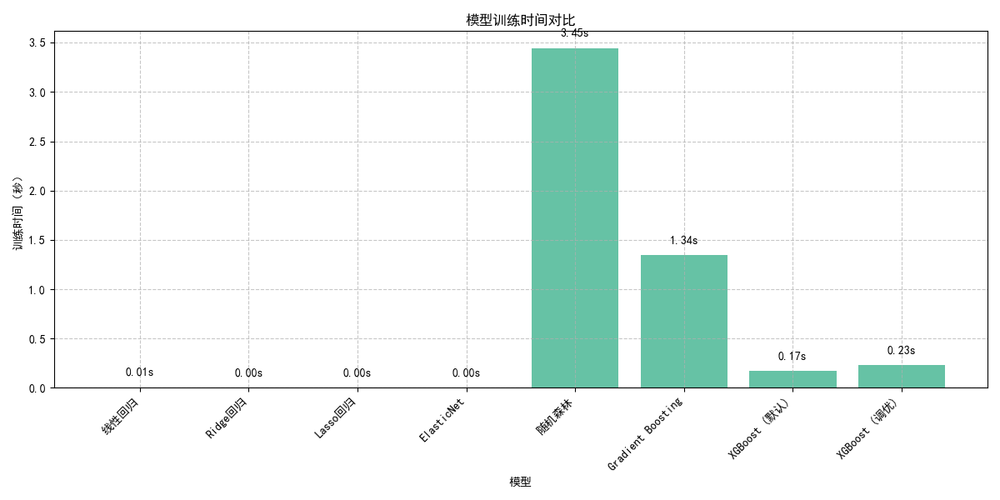

# 二手车价格预测模型研究报告

## 小组成员与分工

- yunmaoQu：数据预处理、特征工程、报告撰写
- yunmaoQu：模型设计与实现、算法优化
- yunmaoQu：数据可视化、结果分析与评估

## 1. 数据集分析与处理

### 1.1 数据集基本信息

本研究使用的是某二手车交易平台的车辆销售数据，包含了2349条记录，每条记录包含13个特征变量。主要特征包括：

- 品牌车型：车辆的品牌和型号
- 价格（万）：二手车的售价，单位为万元（目标变量）
- 上牌时间：车辆的首次上牌时间
- 表显里程（万公里）：车辆已行驶的里程数
- 变速箱：车辆的变速箱类型
- 排量：发动机排量
- 油耗：百公里油耗
- 发动机：发动机功率
- 车辆级别：如紧凑型、中大型等
- 车源所在地：车辆销售地点

### 1.2 数据探索分析

#### 1.2.1 价格分布

从价格分布图可以看出，二手车价格呈现明显的右偏分布，大多数车辆价格集中在较低区间，少数高档车辆价格较高。平均价格约为10.78万元，中位数为7.30万元。

#### 1.2.2 特征相关性分析

通过相关性矩阵分析，我们可以观察到以下关键发现：

1. 车龄（car_age）与价格呈现较强的负相关关系（-0.61），表明车龄越大，价格越低
2. 里程（mileage）与价格也呈现负相关（-0.45），表明行驶里程越多，价格越低
3. 里程与车龄之间存在正相关（0.50），表明车龄较大的车辆通常行驶里程也较多
4. 排量（displacement）与价格呈现正相关（0.37），表明发动机排量越大，价格通常越高

#### 1.2.3 车龄与价格关系

通过车龄与价格的散点图及回归线，可以明显看出随着车龄增加，二手车价格呈现明显的下降趋势。这符合汽车折旧规律，新车在初期几年贬值较快，之后贬值速度减缓。

#### 1.2.4 里程与价格关系

里程与价格也呈现负相关关系，行驶里程越多，价格越低。但相关性强度低于车龄，说明消费者在购买二手车时可能更关注车龄而非里程。

#### 1.2.5 品牌分析

不同品牌的汽车价格存在显著差异，高端品牌如奔驰、宝马等平均价格明显高于普通品牌。这表明品牌是影响二手车价格的重要因素。

### 1.3 数据预处理

为了构建有效的预测模型，我们对原始数据进行了以下预处理：

1. **缺失值处理**：
   - 删除价格或里程为空的样本
   - 对其他数值型特征的缺失值使用中位数填充
   - 对类别型特征的缺失值使用特定类别（"未知"）填充

2. **异常值处理**：
   - 删除价格分布中的极端异常值（低于1%分位数或高于99%分位数）
   - 处理错误格式的里程数据，提取数值部分

3. **特征工程**：
   - 从上牌时间提取车龄信息
   - 从品牌车型中分离出品牌和车型
   - 处理变速箱类型为标准类别（自动、手动、双离合、CVT等）
   - 从排量和油耗字段中提取数值信息
   - 创建年均行驶里程特征（里程/车龄）

4. **特征转换**：
   - 对类别型特征进行标签编码（LabelEncoder）
   - 对数值型特征进行标准化处理（StandardScaler）
   - 生成交互特征和多项式特征（PolynomialFeatures）

预处理后，最终用于模型训练的特征包括：车龄、里程、品牌编码、车型编码、变速箱类型、排量、油耗、年均里程等，以及它们的交互特征。

## 2. 算法基本原理

### 2.1 线性回归（Linear Regression）

线性回归是一种基本的回归算法，假设目标变量与特征之间存在线性关系。线性回归模型可表示为：

$$ y = \beta_0 + \beta_1 x_1 + \beta_2 x_2 + ... + \beta_n x_n + \epsilon $$

其中，$y$是预测目标（二手车价格），$x_i$是特征变量，$\beta_i$是对应的系数，$\epsilon$是误差项。

线性回归通过最小化实际值与预测值之间的均方误差来估计最优参数：

$$ \min_{\beta} \sum_{i=1}^{m} (y_i - \hat{y}_i)^2 $$

### 2.2 随机森林（Random Forest）

随机森林是一种集成学习方法，通过构建多个决策树并取平均值（回归问题）来提高预测性能和减少过拟合。随机森林的主要特点包括：

1. **Bagging（引导聚合抽样）**：从原始训练集中有放回地随机抽取样本构建多个训练子集
2. **随机特征选择**：在生成决策树的每个节点时，从特征子集中选择最佳分割特征
3. **多树投票/平均**：多个决策树的结果取平均作为最终预测结果

随机森林适合处理非线性关系，能够自动进行特征选择，且对异常值和噪声有较好的鲁棒性。

### 2.3 XGBoost

XGBoost（eXtreme Gradient Boosting）是一种梯度提升决策树（GBDT）算法的高效实现，特别适合处理结构化数据。它的核心思想是通过迭代方式，每次训练一个新的决策树来纠正之前树的预测误差。

XGBoost的主要优势包括：

1. **正则化**：引入L1和L2正则化项控制模型复杂度，避免过拟合
2. **梯度提升**：使用梯度下降优化损失函数，每棵新树拟合先前模型的残差
3. **并行计算**：支持并行处理，提高训练速度
4. **处理缺失值**：内置处理缺失值的机制
5. **树剪枝**：采用深度优先生长策略和剪枝技术

XGBoost的目标函数可表示为：

$$ Obj = \sum_{i=1}^{n} l(y_i, \hat{y}_i) + \sum_{k=1}^{K} \Omega(f_k) $$

其中，$l$是损失函数，$\Omega$是正则化项，$K$是树的数量，$f_k$是第$k$棵树。

## 3. 算法模型参数设置

在本研究中，我们实现并比较了多种回归模型，下面列出了各模型的主要参数设置：

### 3.1 线性回归模型

线性回归模型使用默认参数，没有特殊调整。

### 3.2 正则化线性模型

- **Ridge回归**：alpha=1.0（L2正则化强度）
- **Lasso回归**：alpha=0.1（L1正则化强度）
- **ElasticNet**：alpha=0.1，l1_ratio=0.5（L1和L2正则化比例）

### 3.3 随机森林模型

- n_estimators=100（决策树数量）
- random_state=42（随机种子，确保结果可复现）

### 3.4 梯度提升模型

- n_estimators=100（弱学习器数量）
- random_state=42（随机种子）

### 3.5 XGBoost模型（默认参数）

- n_estimators=100（弱学习器数量）
- learning_rate=0.1（学习率）
- max_depth=6（树的最大深度）
- subsample=0.8（样本抽样比例）
- colsample_bytree=0.8（特征抽样比例）
- random_state=42（随机种子）

### 3.6 XGBoost模型（调优参数）

通过网格搜索（GridSearchCV）进行超参数调优，最优参数为：

- n_estimators=200（弱学习器数量）
- learning_rate=0.1（学习率）
- max_depth=5（树的最大深度）
- subsample=1.0（样本抽样比例）
- colsample_bytree=1.0（特征抽样比例）
- random_state=42（随机种子）

## 4. 结果与性能分析

### 4.1 模型性能对比

通过比较不同模型在测试集上的性能，我们得到了以下结果：

| 模型 | RMSE | R² | MAE | MAPE(%) |
|------|------|----|----|---------|
| 线性回归 | 4.80 | 0.46 | 3.49 | 46.04 |
| Ridge回归 | 4.80 | 0.46 | 3.49 | 46.02 |
| Lasso回归 | 4.81 | 0.46 | 3.52 | 46.77 |
| ElasticNet | 4.80 | 0.46 | 3.50 | 46.45 |
| 随机森林 | 3.24 | 0.76 | 1.95 | 22.59 |
| 梯度提升 | 3.32 | 0.74 | 2.18 | 25.64 |
| XGBoost(默认) | 2.89 | 0.81 | 1.81 | 20.43 |
| XGBoost(调优) | 2.80 | 0.82 | 1.72 | 20.16 |

从结果可以看出：

1. 所有基于树的模型（随机森林、梯度提升、XGBoost）表现显著优于线性模型
2. XGBoost模型表现最佳，尤其是经过超参数调优后的XGBoost模型
3. 经过调优的XGBoost模型可以解释约82%的价格变异（R²=0.82）
4. 线性模型表现相对较差，说明二手车价格与特征之间存在复杂的非线性关系

### 4.2 特征重要性分析

通过分析最优模型（调优后的XGBoost）的特征重要性，我们发现：

1. 车龄（car_age）是影响二手车价格的最重要因素
2. 品牌（brand）是第二重要的因素，印证了不同品牌车型价格差异较大
3. 里程（mileage）是第三重要的因素
4. 年均里程（annual_mileage）也具有一定的预测价值

这些发现与我们在数据探索阶段的结果一致，验证了特征工程的有效性。

### 4.3 预测性能可视化

从预测散点图可以看出，模型在低价位车辆的预测更为准确，而对于高价位车辆的预测误差相对较大。这可能是因为高价位车辆在数据集中的样本较少，或者存在更多影响价格的隐藏因素（如特殊配置、定制选项等）。

### 4.4 残差分析

残差分析显示：

1. 残差主要集中在0附近，表明模型预测总体较为准确
2. 残差呈现近似正态分布，符合回归模型的基本假设
3. 高价位车型的残差较大，表明在这一价格区间预测准确度有提升空间

### 4.5 训练时间对比

从训练时间来看，基本线性模型训练速度最快，随机森林和梯度提升模型相对较慢，XGBoost模型虽然复杂度较高但训练速度适中，显示了其良好的计算效率。

## 5. 结论与讨论

通过本研究，我们得出以下结论：

1. 二手车价格主要受车龄、品牌和里程的影响，这三个因素合计解释了大部分价格变异
2. 基于树的模型（特别是XGBoost）比线性模型更适合预测二手车价格，表明特征与价格之间存在复杂的非线性关系
3. 经过调优的XGBoost模型能够实现约82%的R²值，表现出良好的预测能力
4. 针对高价位车辆的预测仍存在一定的误差，可能需要收集更多相关特征或增加高价位样本数量

### 5.1 模型应用价值

本研究开发的二手车价格预测模型具有以下潜在应用价值：

1. 为消费者提供二手车合理价格估计，避免购买时被高估
2. 帮助车主确定合理售价，提高成交效率
3. 为二手车平台提供定价参考，优化定价策略
4. 为汽车金融机构评估二手车抵押价值提供参考

### 5.2 未来改进方向

尽管本模型取得了良好的预测效果，但仍有以下改进空间：

1. 收集更多特征，如车辆配置、内饰状况、事故历史等
2. 扩大数据集规模，特别是增加高端车型的样本
3. 尝试更复杂的模型，如深度学习模型
4. 构建针对特定品牌或价格区间的专门模型
5. 结合时间序列分析，研究二手车价格的季节性变化

## 6. 参考文献

1. Chen, T., & Guestrin, C. (2016). XGBoost: A Scalable Tree Boosting System. In Proceedings of the 22nd ACM SIGKDD International Conference on Knowledge Discovery and Data Mining (pp. 785-794).

2. Breiman, L. (2001). Random Forests. Machine Learning, 45(1), 5-32.

3. Pudaruth, S. (2014). Predicting the price of used cars using machine learning techniques. International Journal of Information & Computation Technology, 4(7), 753-764.

4. Listiani, M. (2009). Support Vector Regression Analysis for Price Prediction in a Car Leasing Application. Master Thesis, Hamburg University of Technology. 